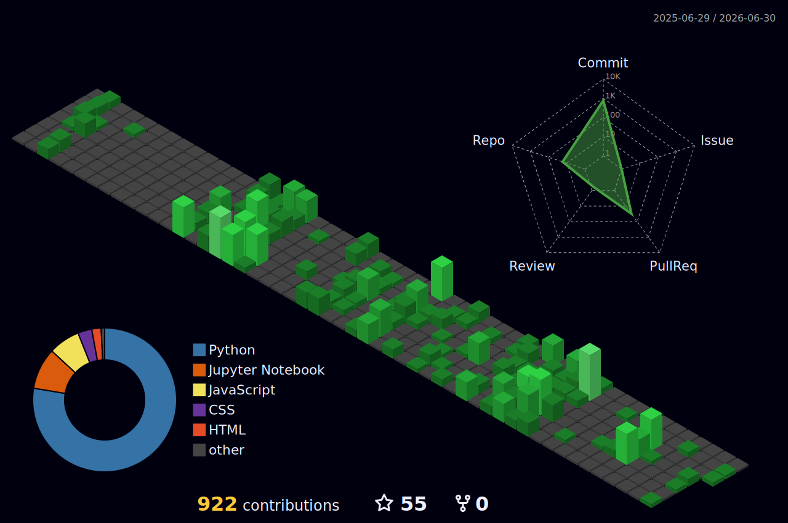

  

  

Welcome to my GitHub! I'm a high school student from Bangladesh passionate about Data Science, Machine Learning, and building real-world automation tools with Python. I love experimenting, analyzing data, and turning raw ideas into functional, well-documented projects.

---

## 🚀 Areas of Interest
- 🔧 Experience with **pandas**, **scikit-learn**, introductory **PyTorch**
- 📚 Reading books that are related to practical ML and Data Science
- 📊 Exploring data analysis, visualization, and ML model development
- 🎯 Familiar with supervised and unsupervised ML techniques
- 🌍 Preparing for undergraduate studies in **Computer Science / AI**

---

## 🌐 Connect with me

  
  &nbsp;&nbsp;&nbsp;
  
  &nbsp;&nbsp;&nbsp;
  

---

## 💻 Tech Stack

  
  
  
  
  
  
  
  
  
  
  
  
  
  
  
  
  
  

---

## 🧑‍💻 Contribution Graph

---

## 📊 GitHub Stats

  

---

## ⚠️ Notice

I'm currently prioritizing my SSC (Secondary School Certificate) examination.
Because of this, I've intentionally paused active Machine Learning project work.

This is a strategic pause, not a shift in interest.
ML-focused development will resume after SSC with stronger fundamentals.

---

## ⭐ **"Code, Learn, Repeat."**
Thanks for visiting! I hope you enjoy exploring my repositories and experiencing my work. It would mean a lot to me if you could star any of them.
**Have a great day!**
